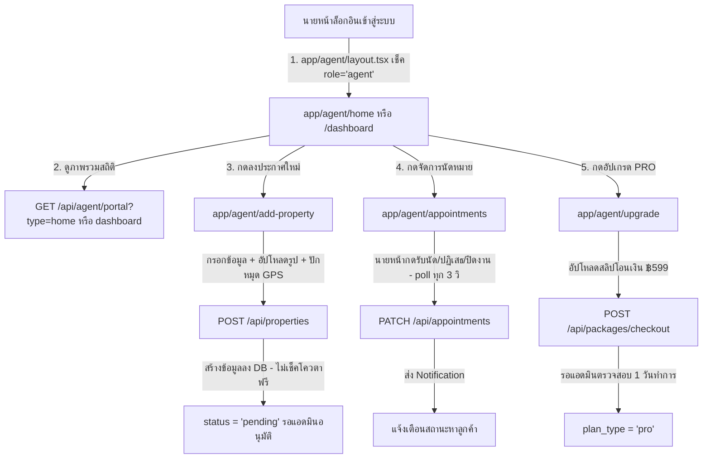

# 🏢 คัมภีร์ระบบการบริหารจัดการฝั่งนายหน้า (Agent Portal Master Guide)
> **เอกสารคู่มืออ่านเตรียมสอบ นำเสนอโครงงาน และอ้างอิงโค้ดโปรเจกต์ SrichaiProperty**
> ฉบับนี้ตรวจทานเทียบกับโค้ดจริงทั้งหมดแล้ว — ฉบับก่อนหน้ามี **ไฟล์หลักที่ขาดหายไปทั้งระบบ** (`app/api/agent/portal/route.ts`, `app/agent/home/page.tsx`) และมีหลายจุด**สร้างข้อมูลที่ไม่มีอยู่จริง** (เช่น `kyc_status` 3 สถานะ, ตาราง `agent_reviews`, การแก้ `specialty_zone` ในหน้าโปรไฟล์, โควตาฟรี 5 ประกาศ) แก้ไขครบทุกจุดแล้ว

---

## 🗺️ บทที่ 0: แผนที่ไฟล์ตามหน้าเว็บที่เปิดจริง (Page ↔ File Map)

| 🖥️ หน้าเว็บที่เห็น | 📁 ไฟล์หน้าโดยตรง | 🔌 API ที่เรียก |
| :--- | :--- | :--- |
| **หน้าแรกนายหน้า** `/agent/home` | [app/agent/home/page.tsx](file:///d:/SrichaiProperty/app/agent/home/page.tsx) — **ไฟล์นี้ขาดหายจากเอกสารรุ่นก่อนทั้งหมด** | `GET /api/agent/portal?type=home` |
| **แดชบอร์ดจัดการประกาศ** `/agent/dashboard` | [app/agent/dashboard/page.tsx](file:///d:/SrichaiProperty/app/agent/dashboard/page.tsx) | `GET /api/agent/portal?type=dashboard`, `DELETE /api/properties/[id]` |
| **ฟอร์มลงประกาศใหม่** `/agent/add-property` | [app/agent/add-property/page.tsx](file:///d:/SrichaiProperty/app/agent/add-property/page.tsx) | `POST /api/properties` |
| **ฟอร์มแก้ไขประกาศ** `/agent/edit-property/[id]` | [app/agent/edit-property/[id]/page.tsx](file:///d:/SrichaiProperty/app/agent/edit-property/%5Bid%5D/page.tsx) | `GET/PATCH/DELETE /api/properties/[id]` |
| **จัดการคิวนัดหมาย** `/agent/appointments` | [app/agent/appointments/page.tsx](file:///d:/SrichaiProperty/app/agent/appointments/page.tsx) | `GET /api/appointments?view=agent`, `PATCH /api/appointments` (poll ทุก 3 วินาที) |
| **โปรไฟล์นายหน้า** `/agent/profile` | [app/agent/profile/page.tsx](file:///d:/SrichaiProperty/app/agent/profile/page.tsx) | `GET/PUT /api/user/profile` |
| **อัปเกรด Verified PRO** `/agent/upgrade` | [app/agent/upgrade/page.tsx](file:///d:/SrichaiProperty/app/agent/upgrade/page.tsx) | `GET /api/user/profile` (เช็คสถานะ), `POST /api/packages/checkout` (อัปโหลดสลิป) |
| **Guard สิทธิ์ทุกหน้าในโซนนายหน้า** | [app/agent/layout.tsx](file:///d:/SrichaiProperty/app/agent/layout.tsx) | เช็ค `session.user.role !== 'agent'` → `redirect('/login/agent')` (**ไม่ใช่หน้าแรกตามที่เอกสารรุ่นก่อนเขียน**) |
| **ข้อมูลประกาศ (backend)** | — | [app/api/properties/route.ts](file:///d:/SrichaiProperty/app/api/properties/route.ts) (POST สร้าง), [app/api/properties/[id]/route.ts](file:///d:/SrichaiProperty/app/api/properties/%5Bid%5D/route.ts) (GET/PATCH/DELETE รายหลัง) |
| **ข้อมูลนัดหมาย (backend)** | — | [app/api/appointments/route.ts](file:///d:/SrichaiProperty/app/api/appointments/route.ts) |

> ⚠️ **ไฟล์หัวใจที่เอกสารรุ่นก่อนไม่เคยพูดถึงเลย:** [app/api/agent/portal/route.ts](file:///d:/SrichaiProperty/app/api/agent/portal/route.ts) เป็น API รวมศูนย์ที่ทั้งหน้า `/agent/home` และ `/agent/dashboard` ใช้ร่วมกัน (แยกโหมดด้วย `?type=home` หรือ `?type=dashboard`) คำนวณสถิติทั้งหมด **ฝั่ง Server** ด้วย Prisma `aggregate`/`_count`/`Promise.all` ไม่ใช่คำนวณฝั่ง Client ด้วย `reduce()` แบบง่ายๆ ตามที่เอกสารรุ่นก่อนเข้าใจผิด

---

## 🌟 โซนที่ 1: ไฟล์หลักที่ต้องจำขึ้นใจ (Core Files to Memorize)

| 📁 ชื่อไฟล์หลัก | 💡 หน้าที่จำสั้นๆ (ท่องจำ) | 💬 คำอธิบายเวลาพูดนำเสนอให้อาจารย์ฟัง |
| :--- | :--- | :--- |
| **1. `app/api/agent/portal/route.ts`** | **🔌 API รวมศูนย์ข้อมูลนายหน้า** | *"เป็น API ตัวเดียวที่ทั้งหน้าแรกนายหน้าและแดชบอร์ดเรียกใช้ร่วมกัน แยกโหมดด้วย query `?type=home` กับ `?type=dashboard` คำนวณสถิติ ยอดวิว มูลค่าพอร์ต จำนวนแชทที่รอตอบ ทั้งหมดฝั่ง Server ครับ"* |
| **2. `app/agent/dashboard/page.tsx`** | **🎨 UI แดชบอร์ดสถิตินายหน้า** | *"เป็นหน้าศูนย์ควบคุมหลักของนายหน้า แสดงสถิติยอดเข้าชมรวม, มูลค่าพอร์ตรวม, ตารางจัดการประกาศ (แก้ไข/ลบ/แชร์/ดูสถิติกราฟ), และคิวนัดหมายล่าสุดครับ"* |
| **3. `app/agent/add-property/page.tsx`** | **🎨 UI ฟอร์มลงประกาศอสังหาฯ ใหม่** | *"เป็นหน้าฟอร์มสร้างประกาศใหม่ รองรับการอัปโหลดรูปภาพหลายรูป, ปักหมุดพิกัด GPS, ตั้งสล็อตเวลาเข้าชม และส่งเข้าคิวรออนุมัติครับ"* |
| **4. `app/api/properties/[id]/route.ts`** | **🔌 API หลังบ้านแก้ไข/ลบประกาศ** | *"เป็น API หลังบ้านทำหน้าที่อัปเดตหรือลบประกาศ โดยมีฟังก์ชัน `requireOwnerAgent` ยืนยันสิทธิ์ว่าเป็นนายหน้าเจ้าของประกาศหลังนี้จริงก่อนทำรายการครับ"* |

> [!TIP]
> **🎬 สคริปต์สรุประบบฝั่งนายหน้าพูดกับอาจารย์ (พูด 30 วินาทีได้คะแนนเต็ม):**
> *"ระบบบริหารจัดการฝั่งนายหน้าของเราอยู่ที่ `app/agent/dashboard`, `/add-property` และ API รวมศูนย์ `app/api/agent/portal/route.ts` ครับอาจารย์:
>
> * **แดชบอร์ดสถิติ & การลงประกาศ:** นายหน้าติดตามสถิติยอดผู้เข้าชม, มูลค่าทรัพย์ในมือ, ลงประกาศใหม่พร้อมอัปโหลดรูปและปักหมุด GPS โดยสถานะเริ่มต้นเป็น `pending` รอแอดมินอนุมัติ — ลงได้ฟรี 3 ประกาศ (`FREE_LISTING_QUOTA`) ก่อนต้องอัปเกรด PRO
> * **การรักษาความปลอดภัย (Owner Verification):** แก้ไข/ลบประกาศต้องผ่าน `requireOwnerAgent` เทียบ `agent_id` กับ session ป้องกันแอบแก้ข้ามบัญชี
> * **การจัดการคิวนัดหมาย:** นายหน้ากดรับนัด (`approved`), ปฏิเสธ (`rejected`) หรือปิดงาน (`completed`) ที่หน้า `/agent/appointments` ซึ่ง poll ข้อมูลใหม่ทุก 3 วินาทีครับ"*

---

# 📂 โซนที่ 2: จำแนกไฟล์ที่เกี่ยวข้องทั้งหมด (Full System File Audit)

| 📁 ชื่อไฟล์ทั้งหมด | 🏷️ ประเภทมอดูล | 💡 หน้าที่และรายละเอียดฟังก์ชัน |
| :--- | :--- | :--- |
| **1. `app/agent/home/page.tsx`** | **Frontend UI** | หน้าแรกสรุปย่อของนายหน้า (ขาดในเอกสารรุ่นก่อน) |
| **2. `app/agent/dashboard/page.tsx`** | **Frontend UI** | ตารางจัดการประกาศเชิงลึก + สถิติกราฟรายทรัพย์ (`PropertyStatsModal`) |
| **3. `app/agent/add-property/page.tsx`** | **Frontend Form** | ฟอร์มลงประกาศอสังหาริมทรัพย์ใหม่ (ส่งสถานะเริ่มต้น `pending`) |
| **4. `app/agent/edit-property/[id]/page.tsx`**| **Frontend Form** | ฟอร์มแก้ไขข้อมูลอสังหาริมทรัพย์รายหลัง |
| **5. `app/agent/appointments/page.tsx`** | **Frontend Page** | จัดการคิวนัดหมาย 3 แท็บ (`new`/`upcoming`/`done`) — คนละชื่อแท็บกับฝั่งลูกค้า (`upcoming`/`past`/`cancelled`) |
| **6. `app/agent/profile/page.tsx`** | **Frontend Page** | แก้ไขชื่อ/เบอร์โทร/LINE ID/รหัสผ่านเท่านั้น — **ไม่มีช่องแก้ `specialty_zone`** |
| **7. `app/agent/upgrade/page.tsx`** | **Frontend Page** | อัปโหลดสลิปโอนเงิน ฿599/เดือน แบบ manual รอแอดมินยืนยัน (ไม่ใช่ระบบตัดบัตรอัตโนมัติ) |
| **8. `app/api/agent/portal/route.ts`** | **Backend API** | API รวมศูนย์สถิติ (`?type=home` / `?type=dashboard`) — **ไฟล์สำคัญที่ขาดในเอกสารรุ่นก่อน** |
| **9. `app/api/properties/route.ts`** | **Backend API** | API สั่งสร้างประกาศใหม่ `POST` + คิวรี่ดึงประกาศฝั่งลูกค้า `GET` — **ไม่มีการเช็คโควตาฟรีฝั่ง Backend เลย** |
| **10. `app/api/properties/[id]/route.ts`** | **Backend API** | API ดึง/อัปเดต/ลบ ประกาศรายหลัง พร้อมฟังก์ชัน `requireOwnerAgent` |
| **11. `app/api/appointments/route.ts`** | **Backend API** | API จัดการคิวนัดหมายฝั่งนายหน้าผ่าน Query Parameter `?view=agent` |
| **12. `app/api/packages/checkout/route.ts`** | **Backend API** | รับไฟล์สลิป (multipart/form-data) บันทึกลง `public/uploads/` แล้วสร้างคำสั่งซื้อรออนุมัติ |
| **13. `app/agent/layout.tsx`** | **Layout Guard** | เช็คสิทธิ์ `role === 'agent'` ทุกหน้าในโซน `/agent/*` — ถ้าไม่ผ่านเด้งไป `/login/agent` |

---

## 📌 บทที่ 1: ภาพรวมสถาปัตยกรรมและเวิร์กโฟลว์หลักฝั่งนายหน้า



---

## 💡 บทที่ 2: อธิบายเจาะลึก 4 เวิร์กโฟลว์ (มาจากไหน? -> ยังไง? -> ทำอะไร? -> แล้วได้อะไร?)

### 🟢 1. การลงประกาศใหม่ (New Listing Workflow)
* 📍 **มาจากไหน:** นายหน้ากรอกฟอร์มลงประกาศใหม่ที่หน้า `app/agent/add-property/page.tsx`
* ⚙️ **ยังไง:** เมื่อกดปุ่มลงประกาศ ระบบจะยิงคำขอ HTTP `POST` ไปยัง API `/api/properties` พร้อมแนบพารามิเตอร์ข้อมูลบ้าน รูปภาพ และสล็อตเวลาว่าง
* 🛠️ **ทำอะไร:** API หลังบ้านตรวจสอบบทบาทนายหน้า สร้างข้อมูลลง DB สถานะ `pending` แล้วบันทึกรูปภาพ/เอกสาร/สล็อตเวลาว่างต่อ (มีระบบกันเปิดวันว่างชนกันเองระหว่างบ้านของนายหน้าคนเดียวกันด้วย `hasAgentSlotConflict`)
* 🏁 **แล้วได้อะไร:** ได้แถวประกาศใหม่ใน PostgreSQL สถานะ `pending` ส่งเข้าคิว Moderation Queue รอแอดมินอนุมัติ
* ⚠️ **ข้อควรระวัง:** ดึงตัวเลข `FREE_LISTING_QUOTA = 3` (จาก `lib/constants.ts`) มาโชว์เป็น "เหลือกี่สิทธิ์ฟรี" บนหน้าแดชบอร์ดเท่านั้น **API `POST /api/properties` ไม่มีโค้ดเช็คจำนวนประกาศเทียบโควตาเลย** — นายหน้าที่ยังไม่อัปเกรด PRO สามารถลงประกาศเกิน 3 รายการได้จริงถ้ายิง request ตรงๆ (เป็นข้อจำกัดเชิง UI เท่านั้น ไม่ใช่ Business Rule ที่บังคับจริงฝั่ง Backend)

---

### 🟢 2. ระบบความปลอดภัยตรวจสอบสิทธิ์เจ้าของประกาศ (`requireOwnerAgent`)
* 📍 **มาจากไหน:** นายหน้ากดแก้ไขหรือลบประกาศที่หน้า Dashboard หรือ `app/agent/edit-property/[id]/page.tsx`
* ⚙️ **ยังไง:** ยิงคำขอ `PATCH` หรือ `DELETE` ไปยัง API `/api/properties/[id]` หลังบ้านจะเรียกใช้ฟังก์ชัน `requireOwnerAgent(propertyId)`
* 🛠️ **ทำอะไร:** โค้ดแกะ `session.user.id` มาเปรียบเทียบกับ `agent_id` ของประกาศในฐานข้อมูล ไม่ตรงกันตอบ 403 ทันที
* 🏁 **แล้วได้อะไร:** ป้องกันนายหน้าคนอื่นแอบส่ง Request มาแก้ไข/ลบประกาศข้ามบัญชี

---

### 🟢 3. การจัดการคิวนัดหมายฝั่งนายหน้า (Appointment Management Workflow)
* 📍 **มาจากไหน:** นายหน้าเข้าใช้งานหน้า `app/agent/appointments/page.tsx`
* ⚙️ **ยังไง:** หน้าบ้านยิง `GET /api/appointments?view=agent` ตอนเปิดหน้า แล้ว **ตั้ง `setInterval` ยิงซ้ำทุก 3 วินาที** เพื่อจำลอง real-time (ไม่ได้ใช้ Pusher/WebSocket เหมือนระบบแชท)
* 🛠️ **ทำอะไร:** นายหน้ากดปุ่มรับนัด (`confirm`), ปฏิเสธ (`reject`), หรือเสร็จสิ้น (`complete`) ส่ง `{ id, action }` ไป `PATCH /api/appointments` — **ไม่มีการส่งเหตุผลการปฏิเสธเลย** (ฟอร์มไม่มีช่องกรอกเหตุผล และ backend ก็ไม่บันทึกลง `cancel_reason` ในกรณี reject)
* 🏁 **แล้วได้อะไร:** สถานะนัดหมายอัปเดตเป็น `approved`, `rejected`, หรือ `completed` ทันที และลูกค้าได้รับ Notification

---

### 🟢 4. ระบบอัปเกรด Verified PRO (Manual Slip Verification Workflow)
* 📍 **มาจากไหน:** นายหน้าเข้าใช้งานหน้า `app/agent/upgrade/page.tsx`
* ⚙️ **ยังไง:** เลือกดูราคาแพ็กเกจ (฿599/เดือน) → กดชำระเงิน → **อัปโหลดรูปสลิปโอนเงินผ่าน PromptPay ด้วยตัวเอง** (ไม่ใช่การตัดบัตรอัตโนมัติหรือเชื่อมต่อ Payment Gateway ใดๆ)
* 🛠️ **ทำอะไร:** `POST /api/packages/checkout` รับไฟล์สลิป (multipart/form-data, จำกัด 5MB, ต้องเป็นรูปภาพ) เซฟไฟล์ลง `public/uploads/` แล้วสร้างคำสั่งซื้อรอแอดมินตรวจสอบด้วยมือ (ไม่ automated)
* 🏁 **แล้วได้อะไร:** เมื่อแอดมินอนุมัติ (ภายใน 1 วันทำการตามที่แจ้งในหน้า) ฟิลด์ `users.plan_type` จะถูกเปลี่ยนเป็น `"pro"` พร้อม `plan_expired_at` — ทำให้**ประกาศทุกรายการของนายหน้าคนนั้น**กลายเป็นพรีเมียม (`isPremium = true`) ลอยขึ้นอันดับแรกในหน้าค้นหาทันที (เช็คจาก `plan_type !== 'basic'` ใน API `/api/properties`) และปลดล็อกโควตาลงประกาศไม่จำกัด

---

## 🗄️ บทที่ 3: โครงสร้างฐานข้อมูลเชิงลึก (Database Schemas & Tables)

อ้างอิงจากไฟล์ **[prisma/schema.prisma](file:///d:/SrichaiProperty/prisma/schema.prisma)**:

### 📊 สรุปตารางฐานข้อมูลที่เกี่ยวข้อง

| 📊 ชื่อตาราง (Table Name) | 🏷️ ประเภทมอดูล | 💡 หน้าที่และรายละเอียด (Function/Role) | 🎯 ความสำคัญและจุดเด่นในการสอบ (Exam Defense Note) |
| :--- | :--- | :--- | :--- |
| **`users`** | Users & Auth | **ตารางเก็บข้อมูลโปรไฟล์นายหน้า (`role_id='agent'`, `status`, `plan_type`, `plan_expired_at`, `specialty_zone`, `kyc_doc`, `phone`, `line_id`)** | **`specialty_zone` ตั้งค่าได้ตอนสมัครสมาชิกเท่านั้น (`/api/auth/register`) ไม่มีหน้าแก้ไขทีหลัง — ใช้แสดงในหน้า `/agents` (ไดเรกทอรีค้นหานายหน้าสาธารณะ)** |
| **`properties`** | Properties | **ตารางหลักเก็บประกาศ (`agent_id`, `status='pending'`, `views_count`, `price`, `reject_reason`)** | **เชื่อม 1:N กับ `users` ผ่าน FK `agent_id`** |
| **`property_images`** | Properties | **ตารางเก็บอัลบั้มรูปภาพประกาศ เรียงตาม `order_index`** | **ติด `onDelete: Cascade` ลบรูปทั้งหมดเมื่อประกาศถูกลบ** |
| **`property_views`** | Analytics | **ตาราง Log บันทึกทุกครั้งที่มีคนเปิดดูประกาศ (timestamp)** | **ใช้วาดกราฟ Time-series สถิติยอดวิวรายวันใน `PropertyStatsModal` ของแดชบอร์ด — เอกสารรุ่นก่อนไม่เคยพูดถึงตารางนี้เลย** |
| **`listing_package_orders`** | Premium Boost | **ตารางประวัติคำสั่งซื้อแพ็กเกจ (ผูกกับ `POST /api/packages/checkout`)** | **`status='active'` ของนายหน้าคนไหน จะทำให้ทุกประกาศของนายหน้านั้น `isPremium=true`** |

> ⚠️ **แก้จากฉบับก่อนหน้า:** เอกสารรุ่นก่อนอ้างว่านายหน้ามีฟิลด์ `kyc_status` แยก 3 สถานะ (`pending`/`verified`/`rejected`) — **ไม่มีฟิลด์นี้ในระบบจริง** สถานะบัญชีจริงใช้ `users.status` (`"pending"`, `"approved"`, `"banned"`) ควบคุมว่าล็อกอินเข้าแดชบอร์ดได้หรือไม่ ส่วนเอกสารยืนยันตัวตนเก็บเป็น URL ไฟล์ในฟิลด์ `kyc_doc` เฉยๆ ไม่มี state machine 3 สถานะแยกต่างหาก

### 3.1 ตารางผู้ใช้ที่เกี่ยวข้องกับนายหน้า (`users`) — เฉพาะฟิลด์ที่เกี่ยวข้อง

| ฟิลด์ (Field) | ประเภทข้อมูล (Type) | หน้าที่และความสำคัญ |
| :--- | :--- | :--- |
| `status` | `VarChar(20)` (default `"pending"`) | สถานะบัญชี: `"pending"` (รอตรวจสอบ, เข้าแดชบอร์ดไม่ได้), `"approved"`, `"banned"`/`"suspended"` (ระงับใช้งาน) |
| `plan_type` | `VarChar(20)` (default `"basic"`) | `"basic"` หรือ `"pro"` — ตัวกำหนด Verified PRO |
| `plan_expired_at` | `DateTime?` | วันหมดอายุแพ็กเกจ PRO (ถ้าเลยวันนี้ถือว่าหมดอายุแม้ `plan_type='pro'`) |
| `specialty_zone` | `VarChar(150)?` | ทำเลที่เชี่ยวชาญพิเศษ — ตั้งตอนสมัครเท่านั้น |
| `kyc_doc` | `VarChar(255)?` | URL เอกสารยืนยันตัวตน (บัตรประชาชน/ใบอนุญาต) |

### 3.2 ตารางหลักประกาศอสังหาริมทรัพย์ (`properties`)

```prisma
model properties {
  id            String    @id @default(dbgenerated("gen_random_uuid()")) @db.Uuid
  title         String    @db.VarChar(150)
  price         Decimal   @db.Decimal(12, 2)
  listing_type  String    @default("sale") @db.VarChar(10)
  status        String?   @default("pending") @db.VarChar(20)
  reject_reason String?   @db.VarChar(255)
  views_count   Int       @default(0)
  agent_id      String?   @db.Uuid
  created_at    DateTime  @default(dbgenerated("timezone('utc'::text, now())")) @db.Timestamptz(6)

  users           users?            @relation(fields: [agent_id], references: [id], onDelete: Cascade)
  property_images property_images[]
}
```

---

## 🔌 บทที่ 4: โค้ดหลังบ้าน API Routes (Backend API Layer)

### 🔹 4.1 API ล็อกความปลอดภัยเจ้าของประกาศ ([app/api/properties/[id]/route.ts](file:///d:/SrichaiProperty/app/api/properties/%5Bid%5D/route.ts))

```typescript
async function requireOwnerAgent(propertyId: string) {
  const session = await getServerSession(authOptions) as { user?: { id?: string; role?: string } } | null;
  if (!session?.user?.id || session.user.role !== "agent") {
    return { error: NextResponse.json({ error: "อนุญาตเฉพาะบัญชีนายหน้าเท่านั้น" }, { status: 401 }) };
  }
  const property = await db.properties.findUnique({ where: { id: propertyId } });
  if (!property) {
    return { error: NextResponse.json({ error: "ไม่พบประกาศอสังหาริมทรัพย์หลังนี้" }, { status: 404 }) };
  }
  if (property.agent_id !== session.user.id) {
    return { error: NextResponse.json({ error: "คุณไม่มีสิทธิ์แก้ไขหรือลบประกาศหลังนี้" }, { status: 403 }) };
  }
  return { property, error: null };
}
```

### 🔹 4.2 API รวมศูนย์สถิตินายหน้า ([app/api/agent/portal/route.ts](file:///d:/SrichaiProperty/app/api/agent/portal/route.ts) — `GET`)

```typescript
export async function GET(request: Request) {
  const agent = await getAgent(); // เช็ค session + role_id === 'agent'
  if (agent.status === 'banned' || agent.status === 'suspended') { /* 403 ระงับใช้งาน */ }

  const type = new URL(request.url).searchParams.get('type'); // 'home' หรือ 'dashboard'

  if (type === 'dashboard') {
    const properties = await db.properties.findMany({
      where: { agent_id: agent.id },
      include: {
        property_types: true,
        property_images: { orderBy: { order_index: 'asc' }, take: 1 },
        _count: { select: {
          appointments: { where: { status: { notIn: ['cancelled', 'rejected'] } } },
          chat_sessions: true,
          saved_properties: true
        } }
      }
    });

    // มูลค่าพอร์ตรวม: บวกเฉพาะประกาศ status='approved' เท่านั้น
    let totalPortfolioValue = 0;
    properties.forEach(p => { if (p.status === 'approved') totalPortfolioValue += Number(p.price); });

    // ดึงข้อมูล Time-series (property_views, appointments, chats, saves) ทุกรายการพร้อมกันด้วย Promise.all
    // เพื่อวาดกราฟสถิติรายทรัพย์ใน PropertyStatsModal

    const isPro = agent.plan_type === 'pro' && (!agent.plan_expired_at || new Date(agent.plan_expired_at) > new Date());

    return NextResponse.json({ properties: /* formatted */ [], totalPortfolioValue: (totalPortfolioValue/1000000).toFixed(1)+' ลบ.', isPro, /* ... */ });
  }
  // type === 'home': สรุปย่อกว่า สำหรับหน้า /agent/home
}
```

> 📝 **สังเกต:** สถิติทั้งหมด (ยอดวิว, มูลค่าพอร์ต, จำนวนแชทที่รอตอบ `pendingChatCount`) คำนวณด้วย Prisma `aggregate`/`_count`/`groupBy` **ฝั่ง Server ทั้งหมด** ไม่ใช่ดึง raw data มา `reduce()` ฝั่ง Client แบบที่เอกสารรุ่นก่อนเข้าใจผิด

---

## 🎯 บทที่ 5: 15 เก็งคำถามเด็ดอาจารย์ถามชัวร์ + สคริปต์ตอบเกรด A+

### ❓ **Q1: ระบบป้องกันไม่ให้นายหน้าคนอื่น มาแอบแก้ไขหรือลบประกาศของนายหน้าท่านอื่นได้อย่างไร?**
* 📍 **ตำแหน่งโค้ด:** [app/api/properties/[id]/route.ts](file:///d:/SrichaiProperty/app/api/properties/%5Bid%5D/route.ts) ฟังก์ชัน `requireOwnerAgent`
> **ตอบ:** *"ระบบมีฟังก์ชันตรวจสอบสิทธิ์ชื่อ `requireOwnerAgent` ครับ: แกะ `session.user.id` มาเทียบกับ `agent_id` ของประกาศในฐานข้อมูล ไม่ตรงกันตอบ HTTP 403 Forbidden ทันที ใช้ตรวจทุก Method (GET/PATCH/DELETE) ของ endpoint นี้ครับ"*

---

### ❓ **Q2: เมื่อนายหน้ากดสร้างประกาศใหม่ ประกาศจะขึ้นหน้าเว็บให้ลูกค้าเห็นทันทีหรือไม่?**
* 📍 **ตำแหน่งโค้ด:** [app/api/properties/route.ts](file:///d:/SrichaiProperty/app/api/properties/route.ts) ฟังก์ชัน `POST`
> **ตอบ:** *"ไม่ขึ้นทันทีครับ! ประกาศที่สร้างใหม่จะถูกตั้งสถานะเริ่มต้นเป็น **`pending`** ส่งเข้าคิว Moderation Queue ให้แอดมินตรวจสอบก่อนกดอนุมัติ (`approved`) ถึงจะไปปรากฏในหน้าค้นหาฝั่งลูกค้า (ซึ่งคิวรีแค่ `status in [approved, active]`) ครับ"*

---

### ❓ **Q3: โควตาการลงประกาศฟรี (Free Quota) กำหนดไว้กี่ประกาศ บังคับจริงไหม?**
* 📍 **ตำแหน่งโค้ด:** [lib/constants.ts](file:///d:/SrichaiProperty/lib/constants.ts) และ [app/api/properties/route.ts](file:///d:/SrichaiProperty/app/api/properties/route.ts)
> **ตอบ:** *"กำหนดไว้ฟรี **3 ประกาศแรก** (`FREE_LISTING_QUOTA = 3`) ครับ **แต่ตัวเลขนี้ถูกใช้แค่แสดงผล UI บนแดชบอร์ด** (`เหลือ ${remainingQuota} สิทธิ์ฟรี`) เท่านั้น — ผมตรวจโค้ด `POST /api/properties` แล้วไม่มีการเช็คจำนวนประกาศเทียบโควตาตรงนี้เลย ถ้ายิง request ตรงๆ เกิน 3 รายการก็ยังสร้างได้ ถือเป็นข้อจำกัดเชิง UX ที่จูงใจให้อัปเกรด ไม่ใช่ Business Rule ที่บังคับจริงระดับ Backend ครับ"*

---

### ❓ **Q4: ระบบดันประกาศพรีเมียม (Priority Sorting) ทำงานอย่างไรฝั่งคิวรี่ DB?**
* 📍 **ตำแหน่งโค้ด:** [app/api/properties/route.ts](file:///d:/SrichaiProperty/app/api/properties/route.ts) ท้ายฟังก์ชัน `GET`
> **ตอบ:** *"ฝั่งหลังบ้านเช็คว่านายหน้ามี Order แพ็กเกจ `status='active'` ใน `listing_package_orders` หรือมี `plan_type !== 'basic'` (สมาชิก PRO) หากเข้าเงื่อนไขใดเงื่อนไขหนึ่งจะตั้งค่า `isPremium=true` ให้ทุกประกาศของนายหน้าคนนั้น แล้วใช้ `.sort((a,b) => (b.isPremium?1:0)-(a.isPremium?1:0))` ดันขึ้นอันดับแรกสุดเสมอครับ"*

---

### ❓ **Q5: การคำนวณสถิติรวมบน Dashboard นายหน้า (ยอดวิวรวม, มูลค่าพอร์ตรวม) คิดอย่างไร?**
* 📍 **ตำแหน่งโค้ด:** [app/api/agent/portal/route.ts](file:///d:/SrichaiProperty/app/api/agent/portal/route.ts) โหมด `type=dashboard`
> **ตอบ:** *"คำนวณฝั่ง Server ทั้งหมดครับ ไม่ใช่ฝั่ง Client: ยอดเข้าชมรวมวนลูป `properties.forEach` บวก `views_count` ทุกประกาศ ส่วนมูลค่าพอร์ตรวมบวกเฉพาะประกาศที่ `status==='approved'` เท่านั้น (ประกาศ pending/rejected ไม่นับ) แล้วหารพัน แปลงเป็นหน่วย 'ล้านบาท' ก่อนส่งกลับ Frontend ครับ"*

---

### ❓ **Q6: เมื่อนายหน้ากดปฏิเสธนัดหมาย (`rejected`) ระบบบังคับให้กรอกเหตุผลหรือไม่?**
* 📍 **ตำแหน่งโค้ด:** [app/agent/appointments/page.tsx](file:///d:/SrichaiProperty/app/agent/appointments/page.tsx) ฟังก์ชัน `handleAction`
> **ตอบ:** *"ไม่บังคับครับ — จริงๆ แล้ว**ไม่มีช่องให้กรอกเหตุผลเลย** กดปฏิเสธแค่ยืนยัน `confirm()` popup ธรรมดา แล้วส่ง `{ id, action: 'reject' }` ไป `PATCH /api/appointments` เฉยๆ ฝั่ง backend ก็แค่เปลี่ยนสถานะเป็น `rejected` ไม่ได้บันทึกอะไรลง `cancel_reason` เลยครับ (ฟิลด์นี้ถูกใช้เฉพาะตอนลูกค้าหรือนายหน้ายกเลิกผ่าน `DELETE /api/appointments` เท่านั้น)"*

---

### ❓ **Q7: หากนายหน้าต้องการแก้ไขรูปภาพหรือพิกัดแผนที่บ้านที่ลงไว้แล้ว ทำได้ไหม ที่ไหน?**
* 📍 **ตำแหน่งโค้ด:** [app/agent/edit-property/[id]/page.tsx](file:///d:/SrichaiProperty/app/agent/edit-property/%5Bid%5D/page.tsx)
> **ตอบ:** *"ทำได้ครับ! กดปุ่ม 'แก้ไข' ที่การ์ดบ้านใน Dashboard ระบบพาไป `/agent/edit-property/[id]` โหลดข้อมูลเดิมผ่าน `GET /api/properties/[id]` มาใส่ฟอร์ม แก้ไขรูป/พิกัด/สล็อตเวลาแล้วบันทึกผ่าน `PATCH` — **ข้อสังเกต:** ถ้าประกาศเคยถูกตีกลับ (`rejected`) แล้วนายหน้าแก้ไขบันทึกใหม่ ระบบจะดันสถานะกลับเป็น `pending` ให้อัตโนมัติเพื่อเข้าคิวอนุมัติใหม่ครับ"*

---

### ❓ **Q8: ปุ่มคัดลอกลิงก์ประกาศไปแชร์ใน Dashboard ทำงานอย่างไร?**
* 📍 **ตำแหน่งโค้ด:** [app/agent/dashboard/page.tsx](file:///d:/SrichaiProperty/app/agent/dashboard/page.tsx) ฟังก์ชัน `handleCopyLink`
> **ตอบ:** *"ใช้ `navigator.clipboard.writeText(`${window.location.origin}/property/${propertyId}`)` คัดลอก URL ลงคลิปบอร์ด แล้วสลับข้อความปุ่มเป็น 'คัดลอกแล้ว' ชั่วคราว 2 วินาทีด้วย `setTimeout` ครับ ไม่ได้ใช้ Toast popup ลอยแยกต่างหาก"*

---

### ❓ **Q9: การตั้งค่าทำเลเชี่ยวชาญพิเศษ (`specialty_zone`) ของนายหน้า แก้ไขได้ที่ไหน มีประโยชน์อย่างไร?**
* 📍 **ตำแหน่งโค้ด:** [app/api/auth/register/route.ts](file:///d:/SrichaiProperty/app/api/auth/register/route.ts) (ตอนสมัคร) และ [app/api/agents/route.ts](file:///d:/SrichaiProperty/app/api/agents/route.ts) (ตอนใช้แสดงผล)
> **ตอบ:** *"บันทึกลงฟิลด์ `specialty_zone` ในตาราง `users` ครับ **แต่ตั้งค่าได้แค่ตอนสมัครสมาชิกเท่านั้น** — หน้า `/agent/profile` ที่ใช้แก้ไขโปรไฟล์ทีหลังไม่มีช่องให้แก้ `specialty_zone` เลย (แก้ได้แค่ชื่อ/เบอร์โทร/LINE/รหัสผ่าน) ค่านี้ถูกนำไปใช้กรองค้นหาในหน้า `/agents` (ไดเรกทอรีนายหน้าสาธารณะ) ผ่าน `contains` query ครับ"*

---

### ❓ **Q10: หากนายหน้ากดลบประกาศอสังหาฯ รูปภาพประกอบประกาศใน DB จะตกค้างไหม?**
* 📍 **ตำแหน่งโค้ด:** [prisma/schema.prisma](file:///d:/SrichaiProperty/prisma/schema.prisma) (FK `onDelete: Cascade` ระหว่าง `properties` และ `property_images`)
> **ตอบ:** *"ไม่ตกค้างครับ! FK ระหว่าง `properties` กับ `property_images` ตั้ง `onDelete: Cascade` ไว้ ลบประกาศแล้วรูปภาพที่เกี่ยวข้องถูกลบตามอัตโนมัติครับ"*

---

### ❓ **Q11: การดึงคิวนัดหมายมาแสดงฝั่งนายหน้า API ใช้เงื่อนไขคิวรี่อย่างไร?**
* 📍 **ตำแหน่งโค้ด:** [app/api/appointments/route.ts](file:///d:/SrichaiProperty/app/api/appointments/route.ts) ฟังก์ชัน `GET`
> **ตอบ:** *"ยิง `GET /api/appointments?view=agent` หลังบ้านเช็คว่ามี `view=agent` ร่วมกับ `user.role_id==='agent'` จะคิวรี่ `where: { agent_id: user.id }` ครับ — ที่หน้า `/agent/appointments` ยังมีการยิงซ้ำทุก 3 วินาทีด้วย `setInterval` เพื่อจำลองความ real-time โดยไม่ใช้ WebSocket ด้วยครับ"*

---

### ❓ **Q12: การยืนยันตัวตน (KYC) ของนายหน้า มีสถานะอะไรบ้าง ควบคุมด้วยฟิลด์ไหน?**
* 📍 **ตำแหน่งโค้ด:** [prisma/schema.prisma](file:///d:/SrichaiProperty/prisma/schema.prisma) (ฟิลด์ `users.status`, `kyc_doc`) และ [app/agent/dashboard/page.tsx:254-269](<file:///d:/SrichaiProperty/app/agent/dashboard/page.tsx#L254-L269>)
> **ตอบ:** *"ระบบ**ไม่มี**ฟิลด์ `kyc_status` แยก 3 สถานะตามที่เอกสารเก่าเข้าใจครับ — ของจริงใช้ฟิลด์ `users.status` (`pending`/`approved`/`banned`) ตัวเดียวควบคุมทั้งบัญชี ถ้ายังเป็น `pending` เข้าหน้า Dashboard จะเจอหน้าจอ 'บัญชีอยู่ระหว่างการตรวจสอบ KYC' บล็อกไว้ ส่วนเอกสารยืนยันตัวตนเก็บแค่ URL ไฟล์ไว้ในฟิลด์ `kyc_doc` เฉยๆ ไม่มี state machine แยกต่างหากครับ"*

---

### ❓ **Q13: เมื่อนายหน้าพาลูกค้าเข้าชมสถานที่จริงเสร็จสิ้น นายหน้าต้องกดปุ่มอะไรในระบบ?**
* 📍 **ตำแหน่งโค้ด:** [app/agent/appointments/page.tsx](file:///d:/SrichaiProperty/app/agent/appointments/page.tsx)
> **ตอบ:** *"กดปุ่ม 'เสร็จสิ้น' (action `complete`) ครับ ยิง `PATCH /api/appointments` เปลี่ยนสถานะเป็น `completed` **แต่ทำได้เฉพาะนัดที่สถานะเป็น `approved` อยู่ก่อนแล้วเท่านั้น** (backend เช็คเงื่อนไขนี้) จากนั้นเปิดโอกาสให้ลูกค้าฝั่งหน้าบ้านกดเขียนรีวิวได้ครับ"*

---

### ❓ **Q14: นายหน้าสามารถแก้ไขคะแนนรีวิว หรือความคิดเห็นที่ลูกค้าเขียนถึงตนเองได้หรือไม่?**
* 📍 **ตำแหน่งโค้ด:** [prisma/schema.prisma](file:///d:/SrichaiProperty/prisma/schema.prisma) (ตาราง `reviews`)
> **ตอบ:** *"ไม่ได้เด็ดขาดครับ! **ชื่อตารางจริงคือ `reviews`** (ไม่ใช่ `agent_reviews` ตามที่เอกสารเก่าเขียน) เก็บแค่ `appointment_id`, `rating`, `comment` — ไม่มีฟิลด์ `agent_id` ตรงๆ ด้วยซ้ำ ต้อง join ผ่าน `appointment_id` ไปที่ `appointments` ถึงจะรู้ว่าเป็นรีวิวของนายหน้าคนไหน นายหน้าเปิดอ่านได้อย่างเดียว ไม่มี API ให้แก้ไขคะแนนของตัวเองครับ"*

---

### ❓ **Q15: การล็อกอินฝั่งนายหน้าแยกต่างหากจากลูกค้าอย่างไร ถ้าสิทธิ์ไม่ถูกต้องระบบพาไปไหน?**
* 📍 **ตำแหน่งโค้ด:** [app/agent/layout.tsx](file:///d:/SrichaiProperty/app/agent/layout.tsx)
> **ตอบ:** *"ใช้ NextAuth Session เดียวกันแต่แยกสิทธิ์ผ่าน `role` ครับ `app/agent/layout.tsx` เช็ค `if (!session || user?.role !== 'agent')` แล้วสั่ง `redirect('/login/agent')` — **ไม่ใช่เด้งกลับหน้าแรกตามที่เอกสารเก่าเขียนไว้** แต่พาไปหน้าล็อกอินเฉพาะของนายหน้าโดยตรงครับ"*

---

## ⚠️ หมายเหตุสำคัญท้ายเอกสาร (จุดที่แก้จากฉบับก่อนหน้า)

1. เพิ่มไฟล์หลักที่ขาดหายทั้งระบบ: `app/api/agent/portal/route.ts` และ `app/agent/home/page.tsx`
2. `FREE_LISTING_QUOTA` จริงคือ **3** ไม่ใช่ 5 — และไม่ได้ถูกบังคับจริงฝั่ง Backend
3. ไม่มีฟิลด์ `kyc_status` 3 สถานะ — ใช้ `users.status` (`pending`/`approved`/`banned`) แทน
4. ชื่อตารางรีวิวคือ `reviews` ไม่ใช่ `agent_reviews`
5. `specialty_zone` ตั้งได้แค่ตอนสมัคร ไม่มีหน้าแก้ไขทีหลัง
6. การอัปเกรด PRO เป็น manual slip upload รอแอดมินอนุมัติ ไม่ใช่ระบบชำระเงินอัตโนมัติ
7. `app/agent/layout.tsx` redirect ไป `/login/agent` ไม่ใช่หน้าแรก
8. นายหน้าปฏิเสธนัดหมายไม่มีการบันทึกเหตุผลลง `cancel_reason`
9. หน้า `/agent/appointments` poll ข้อมูลทุก 3 วินาทีด้วย `setInterval` ไม่ใช่ real-time WebSocket
10. ⚠️ **Label เวลานัดหมาย ("เช้า/บ่าย") มีอย่างน้อย 4 รูปแบบข้อความต่างกันกระจายอยู่คนละไฟล์ในระบบ** — `book-appointment/page.tsx` ใช้ "09:00-12:00"/"13:00-17:00", `api/appointments/route.ts` (GET/POST) ใช้ "10:00-12:00"/"14:00-16:00", `api/agent/portal/route.ts` ใช้ "10:00 น."/"14:00 น." (แบบสั้น) และ "10:00-12:00 น. (ช่วงเช้า)"/"14:00-16:00 น. (ช่วงบ่าย)" (แบบยาว), ส่วน `agent/appointments/page.tsx` เองก็มี `timeSlotLabel()` แยกเป็น "ช่วงเช้า (10:00 น.)"/"ช่วงบ่าย (13:00 น.)" อีกแบบ — ทั้งหมดมาจาก DB คีย์เดียวกันคือ `"morning"`/`"afternoon"` เฉยๆ ไม่มีเวลานาฬิกาจริงเก็บไว้เลย ถ้าอาจารย์ถามเรื่องเวลานัดหมายให้ตอบตามความจริงว่า "ระบบเก็บแค่ช่วงเช้า/บ่าย แต่ข้อความแสดงเวลาไม่ได้รวมศูนย์ จึงมีหลายรูปแบบกระจายอยู่คนละไฟล์"
